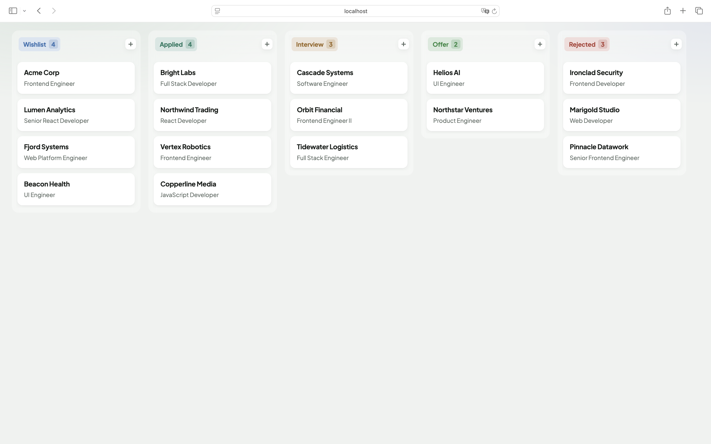

# Application Tracker

A kanban-style job application tracker. Create applications, drag them across pipeline columns, and keep board order consistent on the server.



## Features

- Drag-and-drop board with optimistic UI updates and rollback on failure
- Create, edit, view, and delete job applications
- Server-side board placement with densification when cards move between columns
- Full-stack Docker Compose setup (Postgres + API + SPA)
- Local development with an in-memory H2 database (no Docker required)

## Documentation

| Area | README | Architecture |
|------|--------|--------------|
| Backend (Spring Boot API) | [backend/README.md](backend/README.md) | [backend/ARCHITECTURE.md](backend/ARCHITECTURE.md) |
| Frontend (React SPA) | [frontend/README.md](frontend/README.md) | [frontend/ARCHITECTURE.md](frontend/ARCHITECTURE.md) |

## Tech stack

| Layer | Stack |
|-------|--------|
| Frontend | React 19, TypeScript, Vite, TanStack Query, @dnd-kit |
| Backend | Java 26, Spring Boot 4, Spring Data JPA, Bean Validation |
| Database | H2 (local default), PostgreSQL (Docker / postgres profile) |
| Infra | Docker Compose, multi-stage Dockerfiles, nginx (SPA) |

## Quick start (Docker)

Requires [Docker](https://docs.docker.com/get-docker/) and Docker Compose.

```bash
docker compose up --build
```

| Service | URL |
|---------|-----|
| Frontend | http://localhost:5173 |
| Backend API | http://localhost:8080 |
| Postgres | `localhost:5432` |

Stop with `Ctrl+C`, or run detached with `docker compose up --build -d` and stop with `docker compose down`.

## Local development

### Prerequisites

- **JDK 26** (backend)
- **Node.js 22+** (frontend)
- Optional: Docker, if you want Postgres instead of H2

### Backend

See [backend/README.md](backend/README.md) for profiles, Postgres setup, and tests.

```bash
cd backend
./gradlew bootRun
```

API: http://localhost:8080 (H2 by default)

### Frontend

See [frontend/README.md](frontend/README.md) for scripts, env vars, and tests.

```bash
cd frontend
npm install
npm run dev
```

Dev server: http://localhost:5173

## Project layout

```
application-tracker/
├── backend/                 # Spring Boot API → backend/README.md
├── frontend/                # React SPA → frontend/README.md
├── docker-compose.yml       # Full stack (db + backend + frontend)
└── docker-compose-db.yml    # Postgres only (local apps on the host)
```

## Notes

- APIs are currently open (no authentication). Fine for a local/demo portfolio project; not production-hardened.
- The frontend talks to the API from the browser, so Compose uses `http://localhost:8080` as the API base URL—not the Docker service hostname `backend`.

## License

This project is licensed under the [MIT License](LICENSE).
